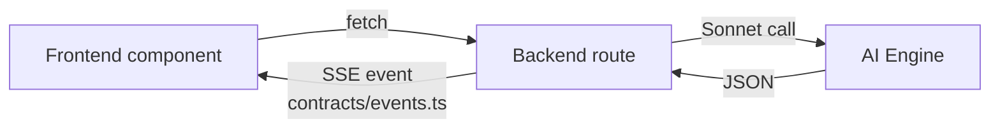

# Agents

The scanner was built — and continues to be maintained — by a small set of specialized agents plus a human (Adrián). This is a consolidated, current-state refresh of the original `AGENT-BACKEND.md`, `AGENT-FRONTEND.md`, `AGENT-AI-ENGINE.md`, `AGENT-ORCHESTRATOR.md` docs, matched against the codebase as it stands on 2026-04-23.

> **Note on nomenclature.** The original build-era docs called these "Backend / Frontend / AI Engine / Orchestrator agents" and expected three parallel Claude sessions during Phase 1–6. Today the codebase is live; maintenance is primarily handled by **Cody** (the coding orchestrator, per-project tmux session `forge-build-forge-scanner`) with **Kova** handling escalation, canon, and cross-domain coordination. The four historical agent roles now function as a **code-ownership taxonomy** enforced in PRs, not as four separate tmux sessions.

## The four roles — what they own, what they must not touch

### Backend
Server-side infrastructure: database, API routes, auth middleware, screenshot pipeline, follow-up orchestration, payments, webhooks, cron, rate limiting.

**Owns:**
- `supabase/**` (migrations, config)
- `src/app/api/**` (all route handlers)
- `src/lib/db/**` (client, types, mappers, admin queries)
- `src/lib/auth/**`
- `src/lib/screenshots/**` (Playwright CDP client + capture pipeline)
- `src/lib/followup/**` (Resend, Twilio stubs, WhatsApp stubs)
- `src/lib/stripe/**`
- `src/lib/rate-limit/**`
- `src/lib/vault/**` (write-back to forge-vault for agent stack)
- `src/middleware.ts`
- `next.config.ts`, `vercel.json`

**Must not touch:** `src/components/**`, `src/lib/ai/**`, `src/lib/prompts/**`, `src/lib/scanner/**`, `src/lib/blueprint/**`, `contracts/**`.

### Frontend
All user-facing pages, components, layouts, animations, design system.

**Owns:**
- `src/app/layout.tsx`, `src/app/page.tsx`, all `src/app/*/page.tsx` files
- `src/components/**`
- `src/styles/**`
- `src/lib/design-tokens.ts`
- `src/lib/gsap-presets.ts`
- `public/**`

**Must not touch:** `src/app/api/**`, `src/lib/db/**`, `src/lib/screenshots/**`, `src/lib/ai/**`, `src/lib/prompts/**`, `contracts/**`.

**Hard rule:** Frontend **never** imports from `src/lib/db/`. It calls API routes and consumes contract-shaped JSON.

### AI Engine
Everything the model sees or emits: prompts, annotation pipeline, stage analyzers, blueprint generation, sales-agent system, follow-up content generation.

**Owns:**
- `src/lib/ai/**` (client, annotate, sales-agent, video-analysis, contact-scraper, objection-classifier, playbook-loader)
- `src/lib/prompts/**` (annotation, stage-summary, funnel-map, mockup, sales-agent-system, openers, email/sms/whatsapp-followup, contact-scrape, video-analysis)
- `src/lib/scanner/**` (orchestrator + 5 stage-* files + analyze-geo + analyze-aeo + ad-detection + detect-google-ads + apify-enrichment + utils)
- `src/lib/blueprint/**` (funnel-map, brand-extractor, mockup-generator)
- `src/lib/prescriptions.ts` (prescription rule engine)

**Must not touch:** `src/app/api/**`, `src/components/**`, `src/lib/db/**`, `src/lib/screenshots/**`, `contracts/**`.

### Orchestrator (Cody / Kova when needed)
Impartial quality gatekeeper. Does not ship features; audits, writes contracts, writes docs, writes fix tickets, verifies, commits.

**Owns:**
- `contracts/**` — the single source of truth for cross-agent types
- `docs/**` — this directory
- `.env.example`
- Audit + fix ticket system (`docs/audits/`, `docs/fixes/`)
- Plans (`docs/plans/`)

**Must not touch:** any source directory. Fixes in source code happen by delegating a fix ticket to the owning agent.

## Model routing (AI Engine)

Consolidated from `AGENT-AI-ENGINE.md`:

| Task | Model | Why |
|---|---|---|
| Screenshot annotation (vision) | Sonnet 4 | visual + strategic |
| Stage summaries | Sonnet 4 | multi-finding synthesis |
| Funnel map generation | Sonnet 4 | strategic reasoning over gaps |
| Mockup HTML generation | Sonnet 4 | creative + code |
| Sales agent conversations | Sonnet 4 (streaming) | objection handling |
| Email / SMS / WhatsApp content | Sonnet 4 | persuasive writing |
| Video content analysis | Sonnet 4 | pattern recognition in metadata |
| Technical checks (tags, pixels) | Haiku 3.5 | fast, formulaic |
| PageSpeed parsing | Haiku 3.5 | structured extraction |
| Contact extraction from HTML | Haiku 3.5 | pattern matching |
| Objection classification | Haiku 3.5 | classification only |

Client impl: `src/lib/ai/client.ts` with `analyzeWithSonnet`, `analyzeWithHaiku`, `streamWithSonnet`.

## Communication protocol

### Contracts as interface

All cross-agent communication is typed. The only file any agent shares with another is `contracts/*.ts`. If a new type is needed by two agents, Orchestrator adds it to contracts **first**, then the producer, then the consumer.

### Event flow (runtime)



Frontend never talks to AI Engine directly. Backend is the only component that invokes AI. AI Engine returns typed JSON → Backend maps to contract shape → Frontend renders.

### PR-time coordination

Most maintenance today is single-PR. Where a change spans ownership:

1. If a contract change is needed, Orchestrator lands it in a preparatory PR (or stacked).
2. Producer side lands second.
3. Consumer side lands third.
4. All three commits reference the same fix ticket if applicable.

## Audit + fix system

Authoritative doc: the original `docs/AGENT-ORCHESTRATOR.md` (kept as historical reference). Operational summary:

### Audits

- Location: `docs/audits/AUDIT-{NNN}.md`
- Append-only. Never edit a prior audit.
- Template lives in `AUDIT-001.md`.

### Fix log (single table)

`docs/fixes/FIX-LOG.md` is the master ledger. One row per fix. Columns:

```
Fix ID | Date | Audit Ref | Assigned To | Ticket | File(s) | Issue | Verified
```

`Verified` ∈ `{ pending, yes, partial, failed, superseded, verified }`.

### Fix tickets

- Path: `docs/fixes/FIX-{NNNN}.md`.
- Template fields: **Audit ref, Assigned to, Priority (P1–P4), Status, Problem, File(s) to modify, Required change, Constraints, Verification, Cross-agent context**.
- Cross-agent fixes split into `FIX-{NNNN}a.md` + `FIX-{NNNN}b.md`. Both share one FIX-LOG row.

### Flow

1. Orchestrator runs audit → creates `AUDIT-{NNN}.md`.
2. For each approved issue:
   a. Append row to FIX-LOG (`Verified = pending`).
   b. Create `FIX-{NNNN}.md`.
   c. If a contract change is needed, Orchestrator applies it first.
   d. Cross-agent → sub-tickets with execution order.
3. Adrián dispatches ticket to owning agent.
4. Agent applies fix **only in its lane**.
5. Orchestrator verifies: `tsc --noEmit`, read modified file, scope check, contract compatibility, targeted regression check.
6. Update FIX-LOG `Verified`.
7. Fix failure → new ticket with `supersedes:`. Two failures on the same subsystem → stop; propose architectural change.

### Commits

- Orchestrator commits verified fix batches as: `[<agent>] fix: FIX-NNNN, FIX-NNNN — <agent> fixes verified` (plus the vault-wide structured commit format).
- Never push to remote. Adrián decides when to push.
- All work happens on a `claude/<slug>` or `feat/<slug>` branch. Never commit to `main` directly.

### Plan registry

- Path: `docs/plans/PLAN-LOG.md` + `docs/plans/PLAN-{NNNN}.md`.
- Tracks multi-session initiatives (redesigns, migrations).
- Read `PLAN-LOG.md` at session start to find active plans. Archived plans live in `docs/plans/archive/` — do not reload as current context.

## Boot sequence (per session)

When Cody (or any Claude Code session) starts in this project:

1. `TZ=America/Monterrey date`.
2. Read `CLAUDE.md` in this repo root.
3. Read `agents/cody.md` → symlinks to `../../forge-agents/cody/CLAUDE.md` (identity + procedures).
4. Read `../../canon/forge-scanner-spec.md` (source of truth).
5. Read the latest `docs/audits/AUDIT-{NNN}.md`.
6. Read `docs/fixes/FIX-LOG.md` to see what's done and pending.
7. Read `docs/plans/PLAN-LOG.md` → if any plan is active, read its file.
8. Begin work.

This is the `CLAUDE.md` § Read-order, expressed procedurally.

## Historical agent docs

The original build-era docs remain for archaeology:

- `docs/AGENT-BACKEND.md` — Phase 1–4 scope for the Backend agent
- `docs/AGENT-FRONTEND.md` — Phase 1–4 scope for the Frontend agent
- `docs/AGENT-AI-ENGINE.md` — Phase 1–5 scope for the AI Engine agent
- `docs/AGENT-ORCHESTRATOR.md` — Audit + fix protocol in full detail
- `LAUNCH-GUIDE.md` (root) — Phase 1–6 parallel spawn instructions used during the original v2 build

These pre-date the current single-session maintenance model; read for historical reference, not as current operating procedure.

## Related

- [DEVELOPMENT.md](DEVELOPMENT.md) — commit format + coding conventions
- [ARCHITECTURE.md](ARCHITECTURE.md) — where each agent's code lives in the system
- [KNOWN-ISSUES.md](KNOWN-ISSUES.md) — open work tracked in FIX-LOG
- Top-level agent identity: `../CLAUDE.md` + `../../forge-agents/cody/CLAUDE.md`
