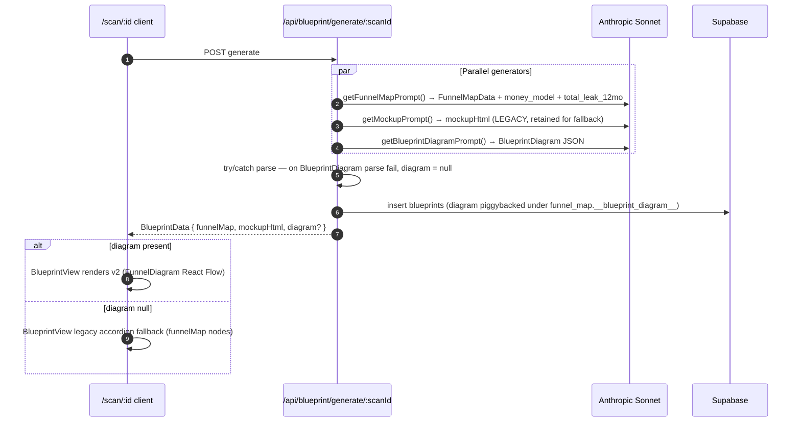

# Architecture

A serverless Next.js 16 App Router app on Vercel, backed by Supabase (Postgres + Storage + Auth) and a self-hosted Chrome CDP endpoint on a Hetzner VPS. Claude Sonnet 4 drives all vision / reasoning / content; Claude Haiku 3.5 handles fast technical checks. All real-time UI is Server-Sent Events, not websockets.

## High-level diagram

```mermaid
flowchart LR
  subgraph Client [Browser]
    Landing[Landing /]
    Scan[/scan/:id/]
    Admin[/admin/*]
  end

  subgraph Vercel [Vercel — Next.js 16 serverless]
    API[API routes]
    Pages[RSC pages]
    MW[middleware.ts<br/>auth + CSP]
    Cron[Cron routes]
  end

  subgraph Supabase
    PG[(Postgres<br/>+ RLS)]
    Stor[Storage<br/>screenshots bucket]
    Auth[GoTrue Auth]
  end

  subgraph Hetzner [Hetzner CX22 VPS]
    Chrome[Headless Chrome<br/>CDP :9222]
    Tunnel[Cloudflare Tunnel<br/>chrome.forgewith.ai]
  end

  subgraph External [3rd-party APIs]
    Anthropic
    Apify
    Resend
    Stripe
    Cal[Cal.com]
    PageSpeed[Google PageSpeed]
    Places[Google Places]
    Meta[Meta Ad Library]
    PostHog
  end

  Landing --> API
  Scan <-->|SSE| API
  Admin --> API
  Pages --> PG
  API --> PG
  API --> Stor
  API --> Auth
  API -->|Playwright CDP| Tunnel --> Chrome
  API --> Anthropic
  API --> Apify
  API --> Resend
  API --> Stripe
  API --> Cal
  API --> PageSpeed
  API --> Places
  API --> Meta
  Landing --> PostHog
  Cron -->|every min / 15 min| API
  MW -. wraps all requests .-> Pages
  MW -. wraps all requests .-> API
```

## Core request / streaming flow — the critical path

```mermaid
sequenceDiagram
  autonumber
  actor U as User
  participant FE as Next.js Client<br/>(/scan/:id)
  participant API as Next.js API<br/>(Vercel)
  participant DB as Supabase Postgres
  participant ST as Supabase Storage
  participant CR as Hetzner Chrome (CDP)
  participant AI as Anthropic Sonnet

  U->>API: POST /api/scan/start { url }
  API->>DB: insert leads + scans
  API-->>U: 201 { scanId, streamUrl }
  note over API: after(runScreenshotPipeline)
  par Background pipeline
    API->>CR: connectOverCDP(BROWSER_WS_ENDPOINT)
    CR-->>API: page screenshots (desktop + mobile, 5 stages)
    API->>ST: upload screenshots
    API->>DB: insert screenshots rows
    API->>AI: runScanAnalysis (5 stages parallel + GEO + AEO)
    AI-->>API: annotations[] per screenshot
    API->>DB: update screenshots.annotations + funnel_stages
  end
  U->>API: GET /api/scan/status/:id  (SSE)
  loop every 1.5s until complete / 5min timeout
    API->>DB: poll scans, funnel_stages, screenshots
    API-->>FE: SSE: screenshot_captured / annotation_ready / stage_completed
  end
  FE-->>U: CapturePrompt @15s, annotations stream in, FunnelHealthSummary at end
  U->>API: POST /api/blueprint/generate/:scanId
  API->>AI: funnel map + mockup HTML
  API->>DB: insert blueprint
  API-->>FE: BlueprintData
  note over FE: 30s no booking → ChatContainer opens
  U->>API: POST /api/chat/start/:scanId → POST /api/chat/message → GET /api/chat/stream/:convId (SSE)
  API->>AI: streamWithSonnet(Hormozi system prompt + scan context)
  AI-->>API: token stream
  API-->>FE: SSE: typing_start → token* → message_complete / data_card / calcom_embed
  U->>Cal.com: Book via modal overlay
  Cal.com->>API: POST /api/followup/webhook/calcom
  API->>DB: insert bookings; cancel pending followups
```

## Component layers

```mermaid
graph TD
  subgraph Contracts
    C1[contracts/types.ts]
    C2[contracts/events.ts]
    C3[contracts/api.ts]
  end

  subgraph AppRouter [src/app — App Router]
    P[pages: / /scan /offer /admin /workbooks]
    R[api/scan, api/chat, api/blueprint, api/followup,<br/>api/payments, api/admin, api/cron, api/workbook, api/auth]
  end

  subgraph Lib [src/lib]
    DB[db/ — client, types, mappers, admin-queries]
    Sh[screenshots/ — pipeline, client (Playwright CDP), social-detector]
    Sc[scanner/ — orchestrator, stage-* x5, analyze-geo, analyze-aeo,<br/>ad-detection, detect-google-ads, apify-enrichment]
    AI[ai/ — client, annotate, sales-agent, video-analysis,<br/>contact-scraper, objection-classifier, playbook-loader]
    Pr[prompts/ — annotation, stage-summary, funnel-map, mockup,<br/>sales-agent-system, openers, email/sms/whatsapp-followup]
    BP[blueprint/ — funnel-map, brand-extractor, mockup-generator]
    FU[followup/ — email-template]
    Stripe[stripe/ — client]
    RL[rate-limit/ — DB-backed]
    Auth[auth/ — admin.ts, config.ts]
    Vault[vault/ — queue-writer, event-writer]
    DT[design-tokens.ts, gsap-presets.ts, prescriptions.ts, api-utils.ts]
  end

  subgraph Comp [src/components]
    Land[landing/*]
    ScanC[scan/* — ScanLayout, ScreenshotCard, StageFindingsView,<br/>FunnelHealthSummary, BlueprintView, CapturePrompt, SocialConfirmation,<br/>AnnotationMarker, AnnotationPopover, HealthPotential, etc.]
    Chat[chat/* — ChatContainer, ChatMessage, ChatInput, DataCard, TypingIndicator]
    Prov[providers/* — SupabaseProvider, CalcomContext, GSAPProvider, PostHogProvider]
    Sh2[shared/* — TopBanner, CalcomModal]
  end

  Contracts --> AppRouter
  Contracts --> Lib
  Contracts --> Comp
  R --> DB
  R --> Sh
  R --> Sc
  R --> AI
  Sh --> Sc
  Sc --> AI
  Sc --> Pr
  AI --> Pr
  BP --> AI
  Comp --> R
  P --> Comp
  R --> RL
  R --> Auth
  R --> Vault
  R --> Stripe
```

## Key architectural decisions

### 1. SSE over websockets for real-time scan progress

- **Why:** Vercel serverless supports SSE natively. Websockets require sticky connections that serverless can't guarantee. SSE is also friendlier to corporate proxies.
- **Shape:** one SSE endpoint per scan (`/api/scan/status/:id`), polling Postgres every 1.5s and pushing diffs. Separate SSE for chat (`/api/chat/stream/:convId`) streaming token-by-token from Anthropic.
- **Events:** fully typed in `contracts/events.ts` (`ScanSSEEvent`, `ChatSSEEvent`). Frontend narrows on `type` field.
- **Tradeoff:** Postgres polling per scan is cheap (one indexed scan), but does put a floor on latency (~1.5s). Good enough for UX; not a message bus.

### 2. Background pipeline via Next.js `after()` — not `waitUntil`, not fire-and-forget

`POST /api/scan/start` returns 201 with `{ scanId, streamUrl }` immediately, then schedules the screenshot + analysis pipeline with `after()` so the Vercel function stays alive until the pipeline resolves. `waitUntil` on Vercel is bounded more aggressively; plain fire-and-forget gets killed the moment the response is flushed.

Seen in `src/app/api/scan/start/route.ts`:

```ts
after(runScreenshotPipeline({ scanId, leadId, websiteUrl }).catch(err => …));
```

### 3. Self-hosted Chrome on Hetzner, not Browserless-only

Browserless works but gets expensive at volume and has cold-start variance. We run Playwright's Chromium image on a Hetzner CX22 (~$4/mo, 2 vCPU / 4 GB / 40 GB) behind a Cloudflare tunnel (`chrome.forgewith.ai`). Next.js connects via `chromium.connectOverCDP(BROWSER_WS_ENDPOINT)`. Browserless remains wired as a fallback (`BROWSERLESS_API_KEY`) for incident resilience. Setup in `docs/HETZNER-SETUP.md`, Dockerfile in `docker/chrome/Dockerfile`.

The Dockerfile uses `socat` to bridge Chrome's 127.0.0.1-only CDP to the container's `0.0.0.0:9222` — required because Chrome refuses to bind `--remote-debugging-address=0.0.0.0` in recent builds.

### 4. Contracts as single source of truth

All shared types live in `contracts/*.ts`. API routes, components, and the AI pipeline **import** from contracts — they do not redefine. The only place types are duplicated is `src/lib/db/types.ts`, which mirrors Postgres snake_case row shapes; conversion to camelCase contract shapes happens through `src/lib/db/mappers.ts`.

Rule: if you need a new type used across layers, add it to `contracts/` first, then consume. Frontend **never** imports from `src/lib/db/` — it calls API routes, which return contract-shaped responses.

### 5. Parallel stage analysis, `Promise.allSettled` isolation

`src/lib/scanner/orchestrator.ts` fires all 5 stages (traffic / landing / capture / offer / followup) concurrently, plus GEO + AEO analysis in a side promise. One failed stage does not stop the others — the orchestrator surfaces each as `stage_completed` or `stage_failed` individually. GEO/AEO findings are folded into the traffic stage post-hoc.

### 6. Progressive capture instead of hard auth gate

Users enter a URL, scan starts, then ~15 s in, `CapturePrompt` slides in asking for email + phone. Blueprint generation requires only the captured email, no OAuth. Google OAuth is a soft "save your results" prompt after the blueprint. This was an intentional scope choice (see `CLAUDE.md` § Known decisions) — auth as gate kills funnel conversion.

### 7. Lead-scoped RLS + anonymous-readable scan results

Postgres RLS is enabled on every table. Scans, screenshots, funnel_stages, blueprints are readable by `anon` so users can view their own `/scan/:id` page without logging in (the URL itself is the bearer token). Service role bypasses RLS for pipeline writes. Leads, conversations, messages, bookings are locked to the authenticated `auth.uid()` when present. See `supabase/migrations/20260318203853_initial_schema.sql` for the full policy set.

### 8. DB-backed rate limiting (atomic RPC)

`src/lib/rate-limit/` calls the `check_rate_limit(p_key, p_type, p_limit, p_window_ms)` Postgres RPC (migration `20260424010000_atomic_rate_limit.sql`). The RPC performs the read-modify-write as a single atomic `INSERT ... ON CONFLICT DO UPDATE` against the `rate_limits` table (key, type, count, window_start) and returns `(allowed, new_count, window_start)`. This replaces the earlier app-level SELECT-then-UPDATE pattern, which had a TOCTOU race under concurrent requests.

Enforces:
- 5 requests / 60 s per IP (burst)
- 20 scans / 24 h per IP
- Chat message limits per conversation

Not Redis, not edge — Postgres is the source of truth, which keeps the limit consistent across Vercel regions.

Hardening adjuncts:
- `src/lib/security/ssrf.ts :: isPrivateOrMetadataHost` — hostname denylist applied in `/api/scan/start` before handoff to the Hetzner Chrome. Blocks loopback, RFC1918, `169.254/16` (cloud metadata), IPv6 `::1` and `fc00::/7`, `.local/.internal/.test` TLDs.
- `src/lib/security/cron-auth.ts :: verifyCronSecret` — `crypto.timingSafeEqual` against the `Bearer ${CRON_SECRET}` header. Used by `rate-limit-purge`, `stale-scans`, and `followup-sender` cron routes.
- `/api/cron/rate-limit-purge` (vercel cron `0 4 * * *`) deletes `rate_limits` rows older than 25h so the table cannot grow unbounded.

### 9. Write-back to forge-vault via queue/event writer

`src/lib/vault/queue-writer.ts` and `event-writer.ts` emit structured records that the Forge agent stack (Kova / Sales Orchestrator / Lore) consumes. The scanner is the **primary lead source** for the agency — captured leads flow out to `shared/inbox/` or the minions task queue for follow-up dispatch.

### 10. AI Sales Agent: streaming + marker-protocol for inline widgets

`src/app/api/chat/stream/[convId]/route.ts` streams Sonnet tokens. The system prompt at `src/lib/prompts/sales-agent-system.ts` teaches the model to emit custom markers (e.g. `[[DATA_CARD:screenshotId]]`, `[[CALCOM_EMBED]]`) which the stream parser converts into `data_card` / `calcom_embed` SSE events. The frontend renders these as inline React components (`DataCard`, `CalcomEmbed`) without leaving the message.

This keeps the conversational feel (text) while allowing rich widgets (booking, evidence cards) without navigating away — consistent with the "$100K feel" rule.

### 11. Middleware: auth + CSP + security headers at the edge

`src/middleware.ts` runs on every non-asset request:

1. Refreshes the Supabase auth session cookie (SSR pattern).
2. Gates `/admin/*` — redirect to `/admin/login` if not signed in; reject if email not in `ADMIN_EMAILS` allowlist.
3. Sets CSP, X-Frame-Options, X-Content-Type-Options, Referrer-Policy, Permissions-Policy, X-XSS-Protection on every response.
4. `api/health` excluded so monitoring pings don't allocate auth work.

### 12. Image loading via Next.js remote patterns restricted to Supabase

`next.config.ts` derives the Supabase hostname from `NEXT_PUBLIC_SUPABASE_URL` at build time and whitelists only `/storage/v1/object/public/**`. All screenshots flow through `next/image` for AVIF/WebP conversion.

### 13. Design system centralized in `design-tokens.ts` + `gsap-presets.ts`

Single source of truth for colors, fonts, spacing, radii, and animation presets. Components import these; they do not invent new values. Animation sequences are documented inline with beat comments so visual reviews can be done from the code alone. See `CLAUDE.md` § Design system for full rules.

## Data flow summary by subsystem

| Subsystem | Entry | Intermediate state | Terminal state |
|---|---|---|---|
| Scan init | `POST /api/scan/start` | leads + scans rows, pipeline scheduled | SSE stream opens |
| Capture | Playwright CDP via `screenshots/pipeline.ts` | PNG buffers | Supabase Storage + `screenshots` rows |
| Analysis | `runScanAnalysis(orchestrator)` | parallel stages | `screenshots.annotations` + `funnel_stages.summary` + `scans.status=completed` |
| Blueprint | `POST /api/blueprint/generate/:scanId` | funnel map JSON + mockup HTML | `blueprints` row |
| Chat | `POST /api/chat/start/:scanId` → `/message` → `/stream/:convId` | messages rows, engagement/objection scoring on `conversations` | `conversations.status` transitions |
| Booking | Cal.com modal → `POST /api/followup/webhook/calcom` | `bookings` row, `conversations.status=booked` | pending followups cancelled |
| Payment | Admin-only `POST /api/payments/create-intent` → Stripe Elements in `/admin/scan/:id` | `payment_intents`, Stripe webhook `POST /api/payments/webhook` | `payments.status=succeeded` |
| Follow-up | Cron `/api/cron/followup-sender` (1 min) / `/nurture-sender` (daily) / `/stale-scans` (15 min) | scheduled `followups` rows | `followups.status=sent` + Resend delivery |

## Cross-cutting patterns

- **Error envelope:** every API error returns `{ error: { code, message, details? } }` (see `contracts/api.ts` `ApiError`). Codes: `RATE_LIMITED`, `INVALID_INPUT`, `NOT_FOUND`, `UNAUTHORIZED`, `INTERNAL`. Helper: `src/lib/api-utils.ts#apiError`.
- **Zod at every boundary:** every API route validates its input with Zod before touching DB or AI. No exceptions, including cron and webhooks.
- **try/catch around every AI JSON parse:** prompts return JSON; the parser wraps in try/catch with a structured fallback. Never crash on a model misformat.
- **Typed SSE write helpers:** SSE formatters live alongside the routes that emit them; they serialize to `data: <json>\n\n` and always include a `type` discriminator.
- **`TZ=America/Monterrey` for all user-facing timestamps** (inherited from the broader Forge convention).
- **Commit format:** `[<agent>] type: description` enforced by `.githooks/commit-msg` at the vault root. Types: `decide / execute / propose / fix / learn / compile / audit / ops / feat` (+ `docs` for doc changes).

## v2 Blueprint Redesign (feat/storytelling-experience, 2026-04-23 →)

This section documents the Blueprint redesign on the `feat/storytelling-experience` branch. The redesign replaces the HTML mockup with a JSON-first industry-ideal funnel diagram, adds industry-agnostic prompt templating, expands finding schemas with structured Hormozi Situation-Complication-Cost-Fix blocks, and scaffolds the Vega live-voice surface. See `CHANGELOG.md` for the commit list.

### v2 Blueprint pipeline



### Prompt output contracts (single source of truth)

Every prompt under `src/lib/prompts/` emits JSON typed against `contracts/types.ts`. Parsers wrap in try/catch; failure → structured fallback, never crashes. Adding a prompt means adding its contract first.

| Prompt file | Contract types | Notes |
|---|---|---|
| `annotation.ts` | `Annotation`, `AnnotationPosition`, `AnnotationType` | Unchanged v1 → v2. |
| `stage-summary.ts` | `StageSummary`, `StageFinding` (+ `situation`/`complication`/`cost`/`fix`) | v2 emits structured blocks; legacy `detail` required for SSE v1 back-compat. |
| `funnel-map.ts` | `FunnelMapData` (+ `money_model: MoneyModelDiagnosis`, `total_leak_12mo: TotalLeak12mo`) | Orthogonality rule: money_model layers do not double-count stage node findings; exactly one layer is `is_biggest: true`. |
| `blueprint-diagram.ts` | `BlueprintDiagram` | Replaces `mockup.ts` output semantics. Industry-ideal Hormozi funnel. `primary_cta.button_label` / `button_subtext` are locked TS literal types. |
| `mockup.ts` | `{ mockupHtml: string; mockupTarget: string }` | **LEGACY** — still called in parallel during rollout; output flows to `BlueprintData.mockupHtml` for fallback only. Planned deletion. |
| `industry-detector.ts` | `IndustryDetection` | Runs once per scan. Confidence < 0.6 → consumers use "your industry". |
| `teaser-finding.ts` | `TeaserFinding` | Single highest-impact finding for capture-gate unlock. `unlock_cta` is locked literal. |
| `sales-agent-system.ts` | Free-form (Vega system prompt) | Emits marker protocol `[[DATA_CARD:id]]`, `[[CALCOM_EMBED]]` — parsed server-side into SSE `data_card` / `calcom_embed` events. |
| `sales-agent-openers.ts` | `string[]` | Conversational openers. |
| `email-followup.ts` / `sms-followup.ts` / `whatsapp-followup.ts` | `string` | Channel-specific prose. Scrubbed of fabrications (Minion 485). |
| `video-analysis.ts` | `VideoAnalysis` | Unchanged. |
| `contact-scrape.ts` | Contact extraction shape | Unchanged. |

#### Locked copy (contract-enforced)

Any drift breaks `bunx tsc --noEmit`:

```ts
// contracts/types.ts
export interface BlueprintPrimaryCta {
  // ...
  button_label: 'Book a call';
  button_subtext: 'If you want this personalized sales funnel implemented in your business, book a call.';
  // ...
}
```

Pre-commit hook (`.githooks/pre-commit`) additionally scans the working tree for fabrication patterns (ex-Shopify, Playbook v2.1, Dr. Kessler, `brightskinclinic.com` defaults) and canon-tier leaks before allowing the commit through. Activate via `git config core.hooksPath .githooks` (per-clone).

### SSE v2 event contract

`contracts/events.ts` `ScanSSEEvent` (narrowed on `type`):

| Event | Payload | When |
|---|---|---|
| `scan_started` | `{ url }` | Pipeline scheduled. |
| `page_discovered` | `{ url, stage }` | URL resolved for a stage. |
| `screenshot_captured` | `{ screenshotId, stage, source, thumbnailUrl, viewport }` | After Storage upload. |
| `social_detected` | `{ platform, handle, url, confidence }` | URL-detector high-confidence hit. |
| `social_ambiguous` | `{ platform, options[] }` | Multiple candidates — user confirms. |
| `capture_prompt` | — | ~15s into scan; triggers `CapturePrompt` modal. |
| `stage_analyzing` | `{ stage }` | Anthropic call started. |
| `annotation_ready` | `{ screenshotId, annotations[] }` | Per-screenshot markers ready. |
| `stage_completed` | `{ stage, summary: StageSummary }` | All annotations + summary ready. |
| `stage_failed` | `{ stage, error }` | Isolated per-stage failure (orchestrator `Promise.allSettled`). |
| `video_analysis` | `{ analysis: VideoAnalysis }` | Video-finding stage. |
| `blueprint_available` | — | Blueprint row inserted; FE can fetch. |
| `scan_completed` | `{ summary: ScanCompletedSummary }` | Terminal success. |
| `scan_failed` | `{ error }` | Terminal failure. |

**Planned additions (follow-on Minion):**

- `teaser_ready` — `{ teaser: TeaserFinding }` — emitted after annotations complete, drives `CapturePrompt` unlock preview.
- Rename `mockup_ready` → `blueprint_ready` (event name drifted from v2 semantics).

### Component → JSON field mapping

How v2 surfaces consume `BlueprintData`:

| Component | Field on `BlueprintData` | Source prompt | Fallback when null |
|---|---|---|---|
| `DiagramHeader` | `diagram.industry`, `diagram.customer_role`, `diagram.weakest_stage`, `diagram.weakest_money_model_layer` | `blueprint-diagram.ts` | Legacy funnel-map heading from `funnelMap.biggestGap` |
| `MoneyModelCard` | `funnelMap.money_model.layers[]`, `funnelMap.total_leak_12mo` | `funnel-map.ts` | Card hidden (null branch) |
| `GrandSlamChecklist` | `diagram.grand_slam_checklist[]` | `blueprint-diagram.ts` | Section hidden |
| `FunnelDiagram.client.tsx` | `diagram.diagram.nodes[]`, `diagram.diagram.edges[]` | `blueprint-diagram.ts` | Legacy accordion over `funnelMap.nodes[]` |
| `OutcomeGuaranteeCard` | `diagram.outcome_guarantee` | `blueprint-diagram.ts` | Section hidden |
| `ObjectionFaqList` | `diagram.objection_faq[]` | `blueprint-diagram.ts` | Section hidden |
| `PrimaryCta` | `diagram.primary_cta` (`button_label`, `button_subtext`, `book_url`) | `blueprint-diagram.ts` | Falls back to `NEXT_PUBLIC_CALCOM_EMBED_URL` + locked copy defaults |
| `CapturePrompt` (v2, pending) | `TeaserFinding` via `teaser_ready` SSE event | `teaser-finding.ts` | Generic capture copy |
| `StageFindingsView` Story Chapter blocks | `StageFinding.situation / complication / cost / fix` | `stage-summary.ts` | Legacy `StageFinding.detail` prose |

### React Flow rendering rules (`FunnelDiagram.client.tsx`)

- **Library:** `@xyflow/react@12.10.2`.
- **Direction:** LTR desktop, TTB on `max-width: 768px` (MQ-sniffed at mount).
- **Node decorations:**
  - `is_critical_upgrade: true` → accent ring + "Start here" pill.
  - `is_missing_in_prospect: true` → dashed border.
  - `stage_category` drives node color bucket.
- **Accessibility:** outer container `role="img"` + aria-label summarizing the flow; nodes are focusable with keyboard.
- **Reduced motion:** MQ-sniffed directly — disables wheel-zoom; global `globals.css` rule additionally kills CSS animations + transitions when `prefers-reduced-motion: reduce`.

### Vega voice configuration (`src/lib/voice/vega-voice-config.ts`)

- **Provider:** ElevenLabs Conversational AI (Agents). Selected for voice quality over Vapi / Retell / OpenAI Realtime — voice quality is the biggest predictor of post-greeting engagement per the reprompting analysis.
- **Brain lives in `sales-agent-system.ts`** (same system prompt used by text Vega). Loaded into the Agent's system-prompt slot at ElevenLabs.
- **Env contract:**

  | Var | Required | Default | Purpose |
  |---|---|---|---|
  | `ELEVENLABS_AGENT_ID` | yes | — | Missing → `getVegaVoiceConfig()` returns `{ provider: 'none', reason }`; UI drops to text Vega. |
  | `ELEVENLABS_API_KEY` | yes | — | Signed URL issuance for client-side widget. |
  | `ELEVENLABS_VOICE_ID` | no | `EXAVITQu4vr4xnSDxMaL` (Sarah) | Swap without redeploy. |
  | `VEGA_LLM_MODEL` | no | `claude-4.6-sonnet` | `gpt-4o` / `claude-4.7-opus` / `gemini-2.0-flash` supported. |
  | `VEGA_MAX_SESSION_MINUTES` | no | 12 | Hard per-session ceiling (soft cost guardrail). |

- **Tools declared (`VEGA_TOOLS`):**
  - `get_scan_summary(scanId)`
  - `get_biggest_leak(scanId)`
  - `get_cal_url()`

  Tool names must match the ElevenLabs dashboard exactly. Webhook: `POST /api/voice/vega-tool-webhook` (handler pending).
- **Text fallback:** `VegaVoiceConfigMissing` is a first-class return. UI must render text Vega without any env present.
- **Secrets rule:** nothing inlined. All reads go through `process.env.*`.

### Industry-agnostic templating

Pre-redesign prompts hardcoded med-spa examples ("Dr. Kessler," "Bright Skin Clinic"). v2 replaces these with template slots filled from `IndustryDetection`:

| Slot | Source | Fallback |
|---|---|---|
| `{{industry_slug}}` | `IndustryDetection.industry_slug` | `'generic'` |
| `{{industry_display}}` | `.industry_display` | `'your industry'` |
| `{{customer_role_singular}}` | `.customer_role_singular` | `'customer'` |
| `{{customer_role_plural}}` | `.customer_role_plural` | `'customers'` |
| `{{typical_avg_ticket_usd.min/max}}` | `.typical_avg_ticket_usd` | $500–$5000 range |

**Rule:** any `IndustryDetection.confidence < 0.6` → treat detection as absent, fall back to `null` for consumers. Downstream prompts then render "your industry" phrasing. Threshold tunable via `INDUSTRY_DETECT_MIN_CONFIDENCE` env (consumer-side).

**Pre-commit hook enforcement:** `.githooks/pre-commit` greps staged diff for fabrication patterns (ex-Shopify Plus, Built in Monterrey, Playbook v2.1, 10-hour Course, Teardown Newsletter, `brightskinclinic.com`) and aborts the commit. One-time setup: `git config core.hooksPath .githooks`.

### Persistence shortcuts (roll-forward path)

Two pragmatic shortcuts in v2, both with a documented migration:

1. **Blueprint diagram JSONB piggyback.** `BlueprintDiagram` is persisted under `blueprints.funnel_map.__blueprint_diagram__` rather than its own column — avoids a migration during the frozen rollout window. Migration: `ALTER TABLE blueprints ADD COLUMN diagram JSONB; UPDATE blueprints SET diagram = funnel_map->'__blueprint_diagram__' WHERE funnel_map ? '__blueprint_diagram__';` + update mapper. Safe because the piggyback is read-only at the consumer boundary (mappers unwrap on read; writers use a single setter path).
2. **Industry detection is ephemeral.** Currently re-run per blueprint generation (or skipped → `null`). Migration plan: add `scans.industry_detection JSONB`, populate once after page capture, cache downstream. Until then, `generateBlueprintDiagram` receives `null` and prompts use generic phrasing.

Both are reversible: revert the v2 branch, piggyback key is ignored by legacy readers.

## Related

- [API.md](API.md) — every route with payload shapes
- [DATA-MODELS.md](DATA-MODELS.md) — schema + RLS + ERD
- [DEPLOYMENT.md](DEPLOYMENT.md) — how this ships
- [AGENTS.md](AGENTS.md) — how the codebase is split across agents
- [../CHANGELOG.md](../CHANGELOG.md) — release notes; redesign entry + follow-on list
- Spec of record: `../../../canon/forge-scanner-spec.md`
