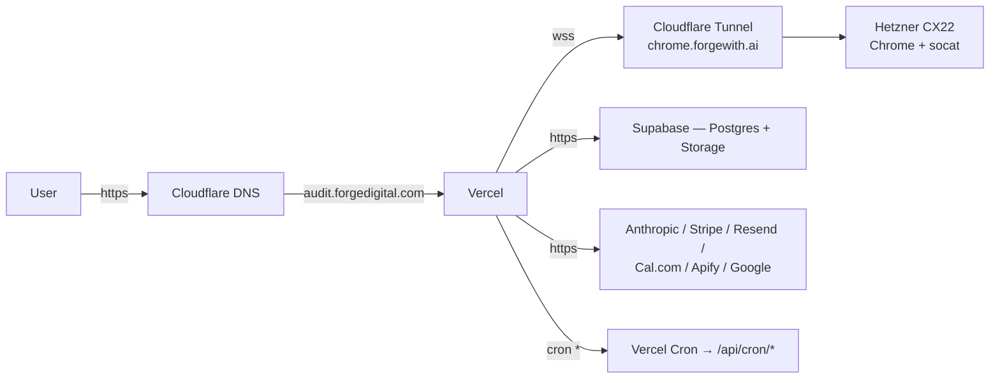

# Deployment

Production bring-up + ongoing deploy flow. Three moving pieces:

1. **Vercel** — serves the Next.js app (pages + API + cron).
2. **Supabase** — Postgres + Auth + Storage.
3. **Hetzner VPS** — self-hosted Chrome CDP behind a Cloudflare Tunnel.

## Topology



## Environments

| Env | Host | Supabase project | Browser endpoint |
|---|---|---|---|
| **local** | `localhost:3000` | local (`supabase start`) or dev branch | `ws://localhost:9222` (Docker) or Browserless |
| **preview** | `forge-scanner-<branch>.vercel.app` | shared dev project | `wss://chrome.forgewith.ai` (prod Chrome, shared) |
| **production** | `audit.forgedigital.com` | prod project | `wss://chrome.forgewith.ai` |

No separate staging cluster for Chrome — preview shares prod Chrome. Production scans have implicit priority via rate limits on the Vercel-side only, not on Chrome itself. If volume becomes an issue, stand up a second Hetzner box and route preview to it.

## Initial prod bring-up

### 1. Provision Supabase

- Create a new project.
- Copy `NEXT_PUBLIC_SUPABASE_URL`, anon key, service role key.
- Enable **Google OAuth** provider (Authentication → Providers). Redirect URLs: `https://audit.forgedigital.com/api/auth/callback`.
- Run migrations:

```bash
bunx supabase link --project-ref <ref>
bunx supabase db push
```

- Verify the `screenshots` bucket was created (Storage → Buckets) and is public.

### 2. Provision Hetzner Chrome

Follow `docs/HETZNER-SETUP.md` end-to-end:

- Hetzner CX22 (~$4/mo, Ubuntu 24.04), Docker, `docker/chrome/docker-compose.yml`.
- Install Cloudflare tunnel, route `chrome.forgewith.ai` → `http://localhost:9222`.
- Verify: `curl https://chrome.forgewith.ai/json/version` returns Browser info.

### 3. Provision Vercel

- Import the `forge-scanner` repo (or sub-path if the vault remains the monorepo).
- Set **Framework Preset** to Next.js.
- Build command `bun run build`, install command `bun install` (enable Bun in project settings).
- Add a custom domain: `audit.forgedigital.com` → Cloudflare CNAME to Vercel.
- Configure env vars (see below).
- Set cron in `vercel.json` (already checked in — every minute + every 15 min).
- Deploy.

### 4. Wire external webhooks

- **Stripe:** add webhook endpoint `https://audit.forgedigital.com/api/payments/webhook`, events `payment_intent.*`. Copy signing secret → `STRIPE_WEBHOOK_SECRET`.
- **Cal.com:** Settings → Developer → Webhooks → add endpoint `https://audit.forgedigital.com/api/followup/webhook/calcom`, events `BOOKING_CREATED / CANCELLED / RESCHEDULED`. Copy secret → `CALCOM_WEBHOOK_SECRET`.
- **Resend:** add sending domain + DNS records; verify. Without this, follow-up email silently fails.
- **PostHog:** create project; host key → `NEXT_PUBLIC_POSTHOG_KEY`.

### 5. First live scan

- Visit `https://audit.forgedigital.com`.
- Enter a real URL.
- Watch `/admin/setup` (after admin sign-in) for green checks across all 25 rows.
- If Chrome endpoint is red: Vercel cannot reach the tunnel. Check Cloudflare tunnel status + VPS `docker compose logs`.

## Environment variables — production matrix

Source of truth is `.env.example`. For production, **all** of the "Needs attention" items in the CLAUDE.md env snapshot should be green. Minimum must-haves:

| Var | Notes |
|---|---|
| `NEXT_PUBLIC_SUPABASE_URL` + anon + service role | prod project |
| `ANTHROPIC_API_KEY` | separate key from dev for budget tracking |
| `BROWSER_WS_ENDPOINT` | `wss://chrome.forgewith.ai` |
| `NEXT_PUBLIC_APP_URL` | `https://audit.forgedigital.com` |
| `NEXT_PUBLIC_CALCOM_EMBED_URL` | prod booking link |
| `CALCOM_API_KEY`, `CALCOM_WEBHOOK_SECRET` | required for booking to close the loop |
| `RESEND_API_KEY` | with a verified domain |
| `STRIPE_SECRET_KEY`, publishable, `STRIPE_WEBHOOK_SECRET` | live keys once we're taking payment |
| `ADMIN_EMAILS` | allowlist, comma-separated |
| `CRON_SECRET` | random 32-byte hex — `openssl rand -hex 32` |
| `GOOGLE_PAGESPEED_API_KEY`, `GOOGLE_PLACES_API_KEY` | optional but high-value |
| `FACEBOOK_APP_ACCESS_TOKEN`, `APIFY_API_TOKEN` | optional enrichment |

Keys that unlock features not yet wired: `TWILIO_*`, `WHATSAPP_*`. Leaving them empty degrades gracefully.

**Secrets hygiene:** never paste a secret inline into a command that will be logged. Set via Vercel UI or `vercel env add`. Pre-commit `gitleaks` hook will reject commits containing secret-shaped strings.

## Deploy flow (ongoing)

1. Work on a `claude/<slug>` or `feat/<slug>` branch.
2. `bun run build` + `bunx tsc --noEmit` locally — both must be clean.
3. Push → Vercel previews auto-deploy.
4. Smoke-test preview against a real URL; check Vercel function logs.
5. Merge PR → production deploys.
6. Post-ship: hit `/admin/setup`, confirm 25 green checks.
7. Optional: run `/api/cron/followup-sender` once manually to confirm sender path works in prod.

## Cron

Vercel Cron invokes registered `/api/cron/*` paths on schedule. `vercel.json`:

```json
{
  "crons": [
    { "path": "/api/cron/followup-sender", "schedule": "* * * * *" },
    { "path": "/api/cron/stale-scans",    "schedule": "*/15 * * * *" }
  ]
}
```

All cron routes require `Authorization: Bearer $CRON_SECRET`. Vercel injects this automatically when the route is registered in `vercel.json`.

## Rollback

### Code rollback

- **Fast path:** Vercel dashboard → Deployments → pick prior green deploy → "Promote to Production". ~30 s.
- **Git path:** revert the offending commit on main → Vercel re-deploys. Preferred when the rollback should persist in the repo history.

### Schema rollback

There is no automatic down-migration. To revert a schema change:

1. Write a new migration that undoes the previous one (e.g., `DROP COLUMN` after `ALTER ADD COLUMN`).
2. `bunx supabase db push`.
3. Redeploy the app code that matches.

Alternative for catastrophic: Supabase dashboard → Backups → restore point. Has a time window — don't rely on it past a week.

### Blob rollback

Storage objects are write-once — rollback is effectively "re-run the pipeline." No object-level versioning enabled.

### Chrome rollback

If a new Playwright image breaks captures:

```bash
ssh root@<hetzner-ip>
cd /opt/forge-chrome
docker compose down
git checkout HEAD~1 -- Dockerfile docker-compose.yml
docker compose up -d
```

The Dockerfile pins the Playwright image to a specific minor version (`v1.58.0-noble` at time of writing). Upgrading is a deliberate action, not automatic.

## Monitoring

Today: minimal — Vercel function logs + PostHog analytics + manual `/admin/setup` checks.

Planned (see `KNOWN-ISSUES.md`):

- Uptime monitor on `/api/health` + `https://chrome.forgewith.ai/json/version`.
- Sentry or Vercel Observability for server-side errors.
- PostHog dashboards for funnel conversion (`scan_started → capture_submitted → blueprint_generated → call_booked → paid`).

## Disaster checklist

| Symptom | First look | Next |
|---|---|---|
| All scans stuck "scanning" | `chrome.forgewith.ai/json/version` 502 | SSH Hetzner, `docker compose ps`, restart |
| All scans fail at analysis | Anthropic 429 / key rotated | check console.anthropic.com usage + `ANTHROPIC_API_KEY` in Vercel |
| No emails going out | Resend domain unverified after DNS change | Resend dashboard → verify; re-send test |
| Cal.com bookings not closing loops | webhook secret drift | re-copy secret, redeploy |
| Admin dashboard shows zeroes | Supabase RLS denied service role (shouldn't happen) | verify `SUPABASE_SERVICE_ROLE_KEY` in Vercel env |
| Rate limit locking legit traffic | `rate_limits` table bloated | `DELETE FROM rate_limits WHERE created_at < now() - interval '48 hours'` |

## Related

- [SETUP.md](SETUP.md) — dev bring-up (shares most env vars)
- [HETZNER-SETUP.md](HETZNER-SETUP.md) — deep-dive on the Chrome box
- [ARCHITECTURE.md](ARCHITECTURE.md) — where each moving part lives
- [KNOWN-ISSUES.md](KNOWN-ISSUES.md) — what's fragile
